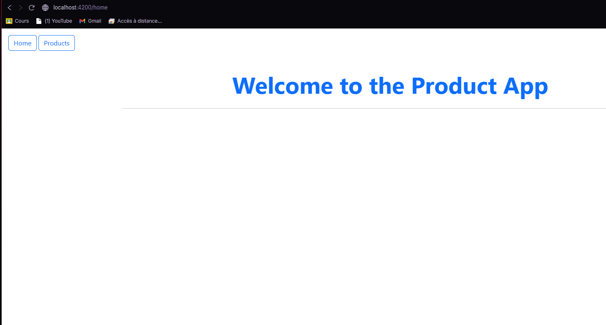

# 📦 TP1 – Gestion de Produits avec Angular & Spring Boot

Ce projet est le premier TP du module **Interactions Avancées** utilisant **Angular** pour le front-end et **Spring Boot** pour le back-end.

Il permet d’afficher, de supprimer et de visualiser des produits à travers une interface web responsive.

---

## 🖼️ Interfaces utilisateur

### 🏠 Interface d’accueil

---

### 📋 Interface des produits

---

## 🚀 Fonctionnalités

- ✅ Affichage de tous les produits
- ❌ Suppression d’un produit
- 🔄 Mise à jour automatique de la liste après suppression
- 🖼️ Icône dynamique selon le statut `selected`

## 🧪 Lancer le projet

### 🔧 Lancer le backend Spring Boot

cd spring-backend
./mvnw spring-boot:run

#### 🔧 🌐 Lancer le frontend Angular

npm install
ng serve